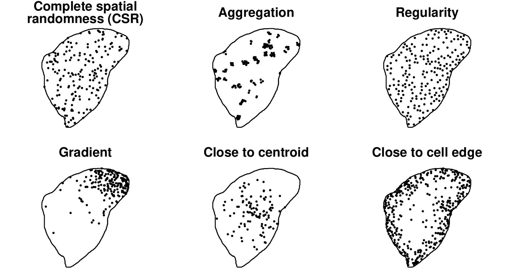
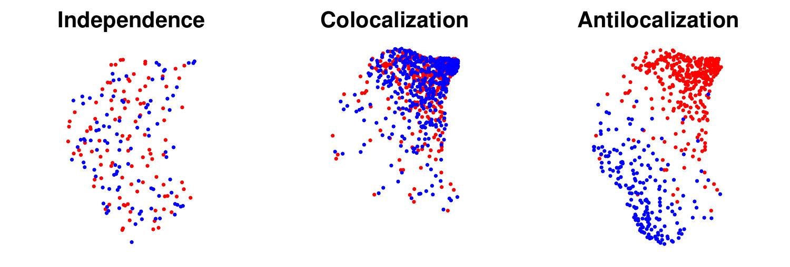
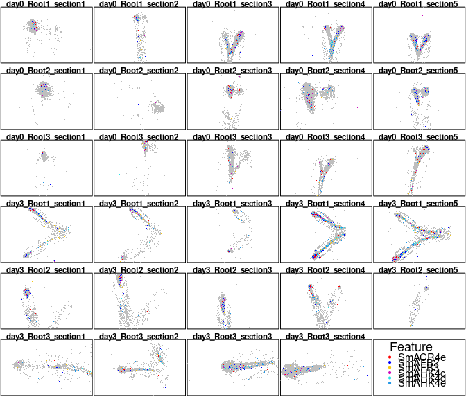
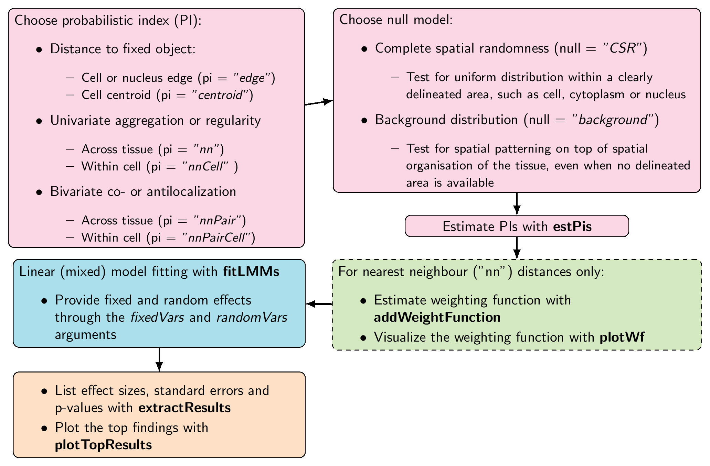

SMOPPIX:
Single-MOlecule sPatial omics data analysed using the Probabilistic
IndeX
================

This repo provides code for analyzing single-molecule spatial omics data
and cell type location data using probabilistic indices as introduced in
our [preprint](https://doi.org/10.1101/2025.05.20.654270). A simple
use-case is shown below, more extensive documentation can be found in
the vignette.

The package can be installed from Bioconductor as follows:

``` r
library(Biocmanager)
install("smoppix")
```

The latest version can be installed from this Github repo as:

``` r
library(devtools)
install_github("sthawinke/smoppix")
```

Once installed, you can load the package

``` r
library(smoppix)
```

Patterns that can be detected by *smoppix*:




For illustration, we now load an example dataset, contained in the
package. It is in table format, so we first convert it to a *spatstat*
hyperframe.

``` r
data(Yang)
hypYang <- buildHyperFrame(Yang,
    coordVars = c("x", "y"),
    imageVars = c("day", "root", "section")
)
```

    ## Found 29 unique images

The number of unique images found is printed, make sure that this is
what you expected. Now to make completely sure the software has
understood us, we make an exploratory plot:

``` r
plotExplore(hypYang)
```

<!-- -->

As an example analysis, we estimate the univariate nearest neighbour
probabilistic index as a measure of aggregation (clustering):

``` r
nnObj <- estPis(hypYang, pis = "nn", null = "background", verbose = FALSE)
```

We add a variance weighting function to prepare for analysis and plot
it:

``` r
nnObj <- addWeightFunction(nnObj, designVars = c("day", "root"))
plotWf(nnObj, pi = "nn")
```

<!-- -->

As expected, the weight allotted to the point pattern increases with the
number of molecules in it: denser patterns provide more precise
estimates of localization patterns.

Next is the inference step: we fit linear mixed models, and show the
most significant results:

``` r
allModsNN <- fitLMMs(nnObj, fixedVars = "day", randomVars = "root")
```

    ## Fitted formula for pi nn:
    ## pi - 0.5 ~ 1 + day + (1 | root)

``` r
head(getResults(allModsNN, "nn", "Intercept"))
```

    ##             Estimate          SE         pVal         pAdj
    ## SmBIRDa    0.2632099 0.006737347 4.411919e-24 3.661893e-22
    ## SmAUX1a    0.3397982 0.005362210 3.185737e-22 1.322081e-20
    ## SmCYCA1;1a 0.3470148 0.006696203 3.403850e-19 9.417320e-18
    ## SmCYB2;4   0.3207545 0.008760854 5.720660e-18 1.187037e-16
    ## SmPFA2b    0.2269031 0.009902372 2.173412e-17 3.607863e-16
    ## SmCYCD3;3a 0.3905425 0.005855202 5.601827e-17 7.749194e-16

Let’s make it visual and plot the most significantly aggregated
transcripts:

``` r
plotTopResults(hypYang, allModsNN, pi = "nn")
```

<!-- -->

Finally write the results to a spreadsheet:

``` r
writeToXlsx(allModsNN, file = "myfile.xlsx")
```

A more extensive description of the *smoppix* functionality can be found
in the vignette, which can be accessed by calling

``` r
browseVignettes("smoppix")
```

A schematic representation of the *smoppix* pipeline is shown below:


