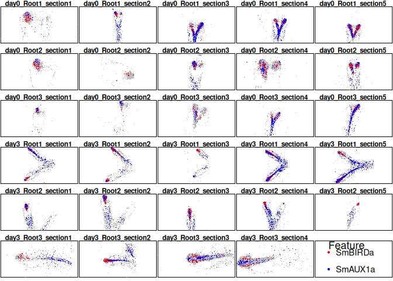

SMOPPIX: Single-MOlecule sPatial omics data analysed using the
Probabilistic IndeX
================
Stijn Hawinkel

This repo provides code for analysing spatial transcriptomics and other
omics data on the single-molecule level using probabilistic indices. A
simple use-case is shown below, more extensive documentation can be
found in the vignette

The package can be installed from GitHub as follows:

``` r
library(devtools)
install_github("sthawinke/smoppix")
```

Load the package

``` r
library(smoppix)
```

Load a dataset, convert it to a *spatstat* hyperframe, and make an
exploratory plot:

``` r
data(Yang)
hypYang <- buildHyperFrame(Yang,
    coordVars = c("x", "y"),
    imageVars = c("day", "root", "section")
)
```

    ## Found 29 unique images

``` r
plotExplore(hypYang)
```

<!-- -->

Estimate the univariate nearest neighbour probabilistic index:

``` r
nnObj <- estPis(hypYang, pis = "nn", null = "background", verbose = FALSE)
```

Add a variance weighting function and plot it

``` r
nnObj <- addWeightFunction(nnObj, designVars = c("day", "root"))
plotWf(nnObj, pi = "nn")
```

<!-- -->

The inference step: fit linear mixed models, and show the most
significant results:

``` r
allModsNN <- fitLMMs(nnObj, fixedVars = "day", randomVars = "root")
```

    ## Fitted formula for pi nn:
    ## pi - 0.5 ~ 1 + day + (1 | root)

``` r
head(getResults(allModsNN, "nn", "Intercept"))
```

    ##             Estimate          SE         pVal         pAdj
    ## SmBIRDa    0.2632099 0.006737347 4.411919e-24 3.529535e-22
    ## SmAUX1a    0.3397982 0.005362210 3.185737e-22 1.274295e-20
    ## SmCYCA1;1a 0.3470148 0.006696203 3.403850e-19 9.076935e-18
    ## SmCYB2;4   0.3207545 0.008760854 5.720660e-18 1.144132e-16
    ## SmPFA2b    0.2269031 0.009902372 2.173412e-17 3.477459e-16
    ## SmCYCD3;3a 0.3905425 0.005855202 5.601827e-17 7.469103e-16

Let’s make it visual and plot the most significantly aggregated
transcripts:

``` r
plotTopResults(hypYang, allModsNN, pi = "nn")
```

<!-- -->

Finally write the results to a spreadsheet:

``` r
writeToXlsx(allModsNN, file = "myfile.xlsx")
```
